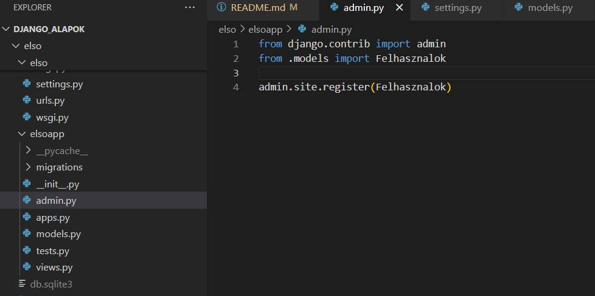

# Django_alapok

```bash

python -m venv venv

venv\Scripts\activate

pip install django 

```

<br>


```bash

django-admin startproject elso

cd elso 

python manage.py runserver

```


```bash 

eredmény: 
August 29, 2025 - 08:53:09
Django version 5.2.5, using settings 'elso.settings'
Starting development server at http://127.0.0.1:8000/
Quit the server with CTRL-BREAK.

```


<h3> Migrálás </h3>

```bash

python manage.py migrate

```

http://127.0.0.1/admin: 


<h3>createsuperuser az admin felülethez</h3>

```bash

python manage.py createsuperuser

```

utána felhasználónév, email jelszó megadása

```bash

Username (leave blank to use '...'): 
Email address: 
Password: 
Password (again):

```


```bash

python manage.py runserver

```


<b>Ha jól dolgoztunk:</b>


```bash

 python manage.py startapp elsoapp

```

belelépek az elsoapp mappába és itt a models.py-ban megírom az első modelt


```python

from django.db import models

class Felhasznalok(models.Model):
    felhasznalonev = models.CharField(max_length=100, unique=True, verbose_name="Felhasználónév")
    emailcim = models.EmailField(unique=True, verbose_name="Email cím")
    jelszo = models.CharField(unique=True, verbose_name="Jelszó", max_length=100)
    keszult = models.DateTimeField(auto_now_add=True, verbose_name="Készült")

    def __str__(self):
        return self.felhasznalonev
    

```
migráláshoz elsoapp hozzáadás settings.py-ban:


admin.py-ban hozzáadjuk a felhasználók modelt:





```python

from .models import Felhasznalok

admin.site.register(Felhasznalok)

```

Migrálás: 

```bash

python manage.py makemigrations elsoapp

python manage.py migrate elsoapp

python manage.py runserver


```

<h3>Ha jól dolgoztunk:</h3>


<b>mentés után</b>

<b>Rákattintva tudjuk szerkeszteni</b>


<h3>Frontend összekötés</h3>


<p><i>átadjuk a python adatbázisunk felépítését</i></p>

```python

from django import forms
from .models import Felhasznalok

class FelhasznaloForm(forms.ModelForm):
    class Meta:
        model = Felhasznalok
        fields = '__all__'

```


<p><i>http POST metódus segítségével az új felhasználók mentése renderelés a struktúra alapján</i></p>

```python

from django.shortcuts import render
from .forms import FelhasznaloForm
from .models import Felhasznalok

def index(request):
    if request.method == 'POST':
        form = FelhasznaloForm(request.POST)
        if form.is_valid():
            form.save()
            form = FelhasznaloForm()  
    else:
        form = FelhasznaloForm()
    
    felhasznalok = Felhasznalok.objects.all()
    return render(request, 'index.html', {'form': form, 'felhasznalok': felhasznalok})

```


<p><i>először az elso/urls.py-ban megadjuk hogy melyik elemet kell keresnie. Az elsoapp-nak az urls.py-eleméét  </i></p>

```python

from django.contrib import admin
from django.urls import path
from django.urls import include

urlpatterns = [
    path('admin/', admin.site.urls),
    path('elsoapp/', include('elsoapp.urls')),
]

```


<p><i>az elsoapp/urls-ben megadjuk, hogy az elsoapp/views-nak az index függvényét keresse</i></p>

```python

from django.urls import path
from django.urls import include
from . import views

urlpatterns = [
    path("", views.index, name="index"),
]


```


<p><i>html template az adatbázis adatainak kiirásához, ezt az elsoapp mappán belül kell létrehozni Ttemplates mappa és ezen belül index.html</i></p>

```html
<!DOCTYPE html>
<html lang="hu">
<head>
    <meta charset="UTF-8">
    <meta name="viewport" content="width=device-width, initial-scale=1.0">
    <title>Regisztráció</title>
</head>
<body>
    
    <h1>Regisztráció</h1>

    <form method="post">
        
        {{ form.as_p }}
        <button type="submit">bevitel</button>

    </form>

    <ul>
        
            <li>{{ felhasznalo.felhasznalonev }} - {{felhasznalo.emailcim}}</li>
        
    </ul>
</body>
</html>
```

<h3>Ha jól dolgoztunk:</h3>

http://127.0.0.1:8000/elsoapp/


http://127.0.0.1:8000/admin/elsoapp/felhasznalok/
